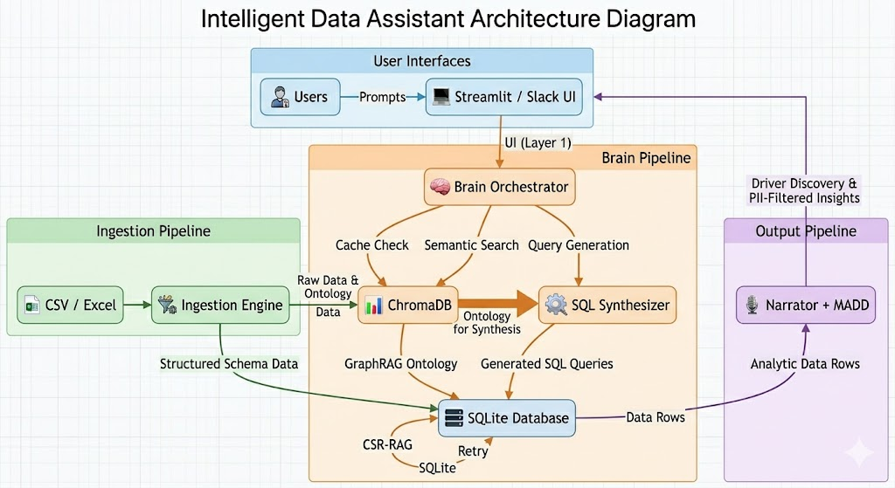

# 🧿 Vantage: Universal Agentic Data Intelligence

Vantage is a high-performance, self-service intelligence platform designed to eliminate hallucinations and lower the barrier to analytics. Upload any valid CSV or Excel file, and instantly "talk" to your data through a premium, dynamically animated Streamlit dashboard or via our enterprise Slack bot. 

Vantage bridges the gap between raw data and verifiable business insights using a state-of-the-art Quad-Layer reasoning architecture.

---

## 🚀 Key Features

### 1. Quad-Layer Intelligence Engine (Zero Hallucination)
- **GraphRAG & GBEC Cache:** Converts flat tables into a rich semantic ontology and caches queries via L2-distance in ChromaDB for instant, zero-latency retrieval.
- **TASG & Auto-Repair (CSR-RAG):** Generates time-aware SQL grounded in dataset bounds. Actively catches syntax failures and auto-repairs invisibly using a secondary LLM loop.

### 2. Explainable AI & Intelligence Canvas
- **The "Why" Engine (MADD):** Instead of just answering *what*, Vantage proactively extracts underlying drivers, calculates % contributions, and explains *why* numbers changed.
- **Dynamic Exploration:** Features natural chat, step-by-step reasoning traces, auto-generated Plotly visuals, and context-aware follow-up suggestions to guide analytical discovery.

### 3. Instant "Data DNA" Onboarding
- **Universal dataset compatibility:** Drop in **any** CSV/Excel (no fixed schema required).
- The pipeline instantly pre-computes bounds, defines semantic types, redacts incoming PII, and extracts zero-query insights (dominating drivers, anomalies, trends) before you even ask a question.

### 4. Modular Premium UI & Omni-Channel Slack
- **3-Panel Glassmorphism Dashboard:** Independent scroll zones for Data DNA (Left), Interactive Chat Canvas (Center), and Trust & Execution visibility (Right) utilizing an unbroken ChatGPT-style interaction flow.
- **Enterprise Slack Bot:** Seamlessly interrogate datasets via responsive Slack Block Kit layouts for intelligent insights anywhere outside the dashboard.

---

## 📂 Project Architecture



Vantage operates on a secure, closed-loop **Triple-Layer Pipeline**:
1. **Ingestor (The Loader):** Raw flat files are scrubbed, mapped into a secure SQLite database, and conceptually pushed into a ChromaDB semantic index.
2. **Brain (The Orchestrator):** Human questions trigger a TAG-planner that checks memory caches, generates SQL securely, and autonomously auto-repairs any syntax or schema mismatches in milliseconds.
3. **Delivery (The Explainer):** Output is piped through a narrator to strip PII and calculate data drivers before being pushed to the Streamlit UI or Slack Bot.

---

## 🛠️ Quickstart & Setup

1. **Environment Initialization**
   Create and activate a Python 3.10+ virtual environment.
   ```bash
   pip install -r requirements.txt
   cp .env.example .env
   ```
   *Fill in your required LLM and Slack API keys inside `.env`.*

2. **Run the Primary Dashboard**
   ```bash
   streamlit run Home.py
   ```

3. **CLI Data Ingestion (Optional)**
   ```bash
   python ingestor.py /path/to/your_data.csv
   ```

4. **Launch the Slack Agent**
   ```bash
   python interfaces.py --mode slack
   ```

---

*Vantage sets a new standard for text-to-SQL — where stunning design meets unparalleled factual integrity.*